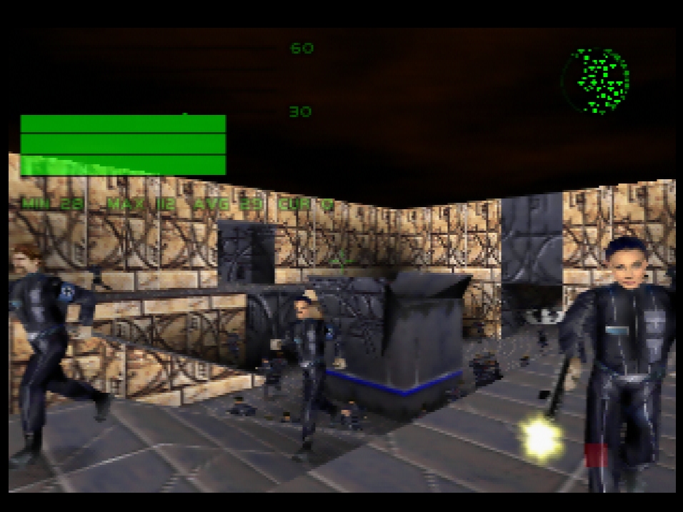

# Perfect Dark - Max Bots

A mod that lets you play with over 400 bots in multiplayer.

(Don't be fooled by that frame rate graph. 30 FPS is from the setup menu, and those are all 0 FPS frames while the match was playing.)

The mod changes the following from the stock game:

User-facing/obvious changes:

* The expansion pak is required.
* The "Small But Perfect Menu" is used, as the mod only allows Combat Simulator. However the full 8MB Advanced Setup menu is available.
* All unlockable features are unlocked by default.
* The Advanced Setup > Simulants dialog allows you to assign a quantity to each slot.
* During the initial spawn, any pad in the stage (not just spawn points) will be used to spawn bots.
* The options dialog has an option to hide bots on the radar.

Less obvious, or behind the scenes changes:

* Press L to toggle the frame rate graph.
* With the frame rate graph shown, press up on the D pad to toggle the page between the graph and some memory figures.
* All rooms and available weapons are preloaded.
* Much of the code and data relating to the single player game has been removed, to allow more memory for bots.
* When characters are shot, the vertex colouring on their body no longer occurs.
* The data structures representing MP characters have been completely restructured. The game previously had a one to one mapping of a "mpchr" to a configuration slot, while now it allows multiple mpchrs to share a single configuration slot.
* The logic for prop tick scheduling has been simplified, and bots will tick less frequently when off-screen than in the original game.

Bugs:

* Opening the character selection menu causes crash.
* Playing with around 425 bots causes a crash after a few seconds.
* There may be some bugs if you don't use consecutive controller numbers (eg. controller 2 only, or controllers 1 and 3).

## How does it work?

The 8 bot slots still exist, but now each of them can have a quantity of 1 to 100 bots. This makes for a theoretical max of 800 bots, but you'll run out of memory shortly after 400. And your frame rate will probably become a slideshow at around 150.

The simulant type, difficulty and team is assigned per slot. So if you wanted to have 100 MeatSims and have them split into two teams you'd have to create two slots of 50 each.

When starting the match, the mod tries to determine how many bots can be allocated based on the current free memory minus what it estimates is yet to be allocated. However this somewhat of a waste of effort because the bot limit is capped by your willingness to play at 0 FPS rather than capped by memory.

All bots start off in the "foreground" which means they tick on every frame. They gradually move to the background as the game figures out which ones are off-screen. The background ones will tick less often. In other words, with a lot of bots your frame rate will start off extremely bad and over several seconds will improve until it's just very bad. And looking into a big room with lots of bots will cause them all to move to the foreground, which will tank the frame rate again.
